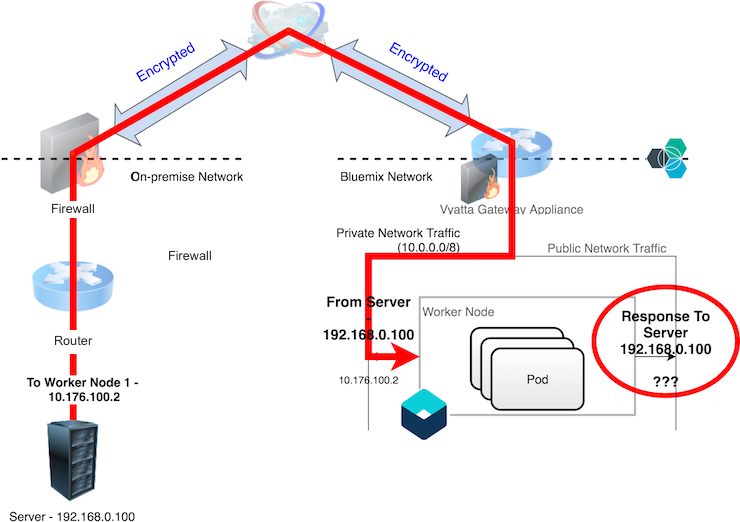
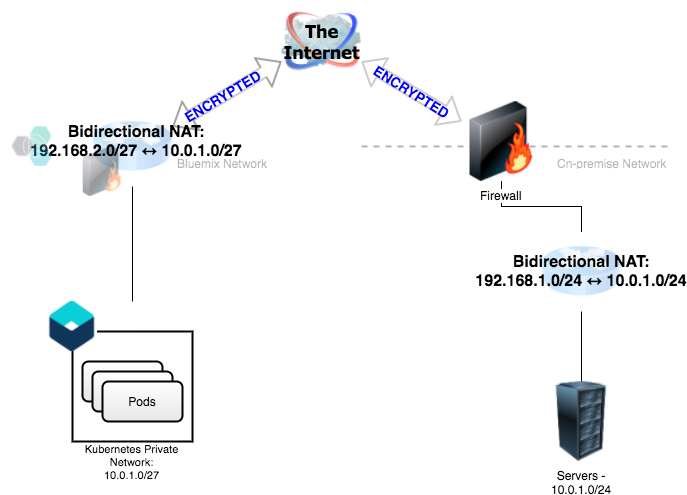

# IBM Kubernetes Service - Adding private network static routes via DaemonSet

***NOTE: This repo is now deprecated. Please follow [the documentation](https://cloud.ibm.com/docs/containers?topic=containers-static-routes) here on the official supported solution to this problem.  The README here is left for historical purposes.***


When connecting a IBM Kubernetes Service (IKS) cluster to networks on-premise, we can utilize a Virutal Router Appliance to serve as an IPSec VPN endpoint.

However, because all worker nodes are placed on both the private and public networks in IBM Cloud Infrastructure, the static route table in each worker node contains a route for the private network (10.0.0.0/8) and the public network (default route). This results in the diagram below:



Because of [Reverse Path Filtering](http://tldp.org/HOWTO/Adv-Routing-HOWTO/lartc.kernel.rpf.html), the worker node will drop the response because the kernel's route table does not contain a route for where the packet originated from.

The included DaemonSet discovers the gateway for the private network (i.e. the route for 10.0.0.0/8) and adds the static routes for the on-premise subnets for the private network to the route table.

## DaemonSet Usage

Update the yaml for the [ConfigMap](https://kubernetes.io/docs/tasks/configure-pod-container/configure-pod-configmap/) [static-routes-configmap.yaml](static-routes-configmap.yaml) using an editor.  The `routes` key in the ConfigMap contains a JSON array containing an array of on-premise subnets to add to each worker nodes' static route table.

Add this to Kubernetes using the `kubectl` command:

```bash
kubectl create -f static-routes-configmap.yaml
```

Before using the DaemonSet, we create a [ServiceAccount](https://kubernetes.io/docs/reference/access-authn-authz/service-accounts-admin/), [Role](https://kubernetes.io/docs/reference/access-authn-authz/rbac/#role-and-clusterrole), and [RoleBinding](https://kubernetes.io/docs/reference/access-authn-authz/rbac/#rolebinding-and-clusterrolebinding) to limit the access of the DaemonSet only to the `static-routes` ConfigMap.  Add these resources to Kubernetes:

```bash
kubectl create -f serviceaccount.yaml
kubectl create -f role.yaml
kubectl create -f rolebinding.yaml
```

Next, create the [DaemonSet](https://kubernetes.io/docs/concepts/workloads/controllers/daemonset/) which uses the service account and adds the `CAP_NET_ADMIN` privilege to manipulate each worker node's static route table.

```bash
kubectl create -f add-static-route-daemonset.yaml
```

## A note about subnet overlap

Because IBM Cloud Infrastructure assigns the worker nodes from the Kubernetes clusters with addresses using subnets from the reserved class A block for private subnets (10.0.0.0/8), this may overlap with the address space used by many on-premise networks.  The subnet overlap may cause confusion in the IPSec endpoint as it needs to connect resources in two networks that appear to be using the same address space.

A common workaround to this problem is to define a one-to-one mapping at the router level using unused private address space using Bi-directional NAT.



In this example, the router translates the IP addresses as shown in the diagram before routing it to the destination.  When configuring the Bluemix side of the tunnel, we specify the on-premise subnet as 192.168.1.0/24 (and also place that in our ConfigMap).  Any packets destined for on-premise will be forwarded over the tunnel where the remote endpoint will translate that to the matching address in 10.0.1.0/24 before forwarding the packets to the destination.  Similarly, on the on-premise side of the tunnel, we configure the Cloud subnet as 192.168.2.0/27, and configure the Vyatta Gateway Appliance to translates that to the matching address in 10.0.1.0/27 before forwarding the packets to the destination.
